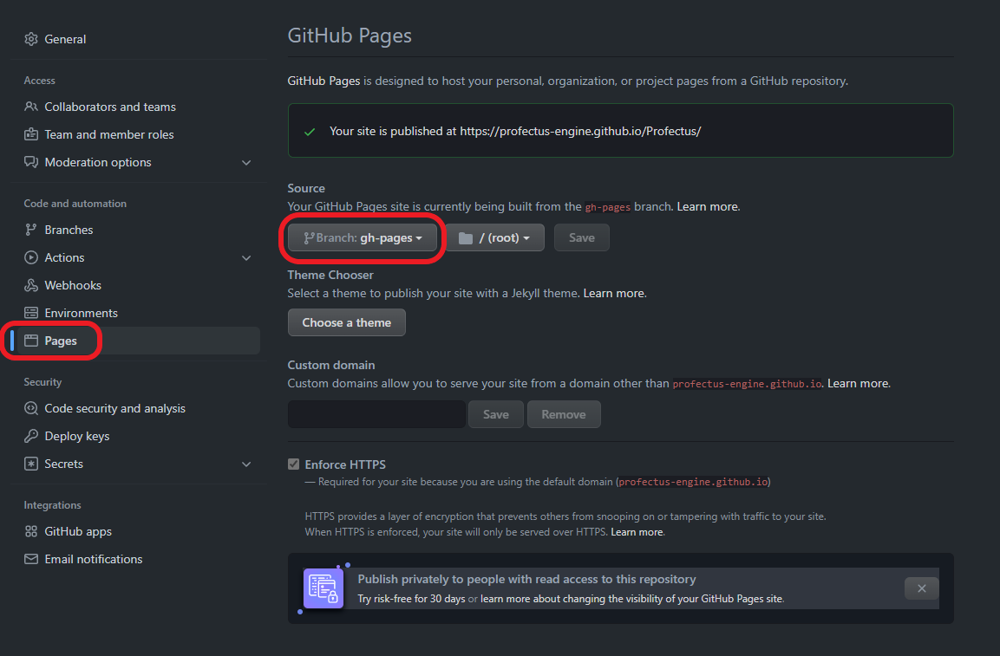

# Getting Started

## Setting up environment

### Tools

Profectus requires a node development environment in order to work on a project. If you are familiar with node, then you can skip this section.

If you are comfortable with/willing to use the command line, it is recommended to download the following:

- [git](https://git-scm.com/downloads)
- [node](https://nodejs.org/en/download/)

If you'd like, you can also choose to use [replit](https://replit.com) or [glitch](https://glitch.com), which has several pros and cons, but one of the pros is not needing to setup any tool on your own computer.

### Creating your project

If you are using git, you should create a new project from the [Profectus repository](https://github.com/profectus-engine/Profectus). You can then copy the link for the repository to clone it locally.

::: info
Since the repository is a template repository, you can easily create new repos from it, allowing you to have multiple project easily. However, it does make updating an existing project to a newer version of Profectus more difficult.
:::

It's recommended to create a new git branch for development, so you can push your changes without it affecting the live build. This allows you to continue working with smaller commits, and only release new versions when you're actually ready to. The github workflow will automatically rebuild the page whenever you push to the `main` branch.

The next step is to install Profectus' dependencies. This is as simple as running `npm install`.

### Running your project

You can now run `npm serve` to start a local server that will host your project so you can work on it. As you change files the site will automatically reload them.

## Project structure

At least to start, everything you'll be messing with is inside the `/src/data` directory. This contains everything specific to the project itself, from its metadata, the content itself, utility functions, a changelog, and any custom UI themes.

### Setting up project metadata

The first file you'll want to edit is `/src/data/modInfo.json`. This contains information on the name of the project, its creator, a discord server to link to, and some other general information about the project.

### Creating your project

Being actually creating your project content by editing `mod.tsx`.

## Deploying

If you're using git, deploying is as easy as pushing your changes to the `main` branch. In a couple minutes the site will be updated fully automatically. If you'd like to see progress on it, or look at any errors that happened, you can do so from the actions tab on your repository.

Before github knows to actually host the generated site, you'll have to enable github pages in the repo settings. This just means selecting the branch to use - `gh-pages`. You will only need to perform this step once. This will automatically start another github action to deploy the website.

Once the action completes, your project should be available at `https://<YOUR_GITHUB_USERNAME>.github.io/<YOUR_REPO_NAME>/`. For example, the TMT Demo project hosted at https://github.com/profectus-engine/TMT-Demo is available at https://profectus-engine.github.io/TMT-Demo/.
